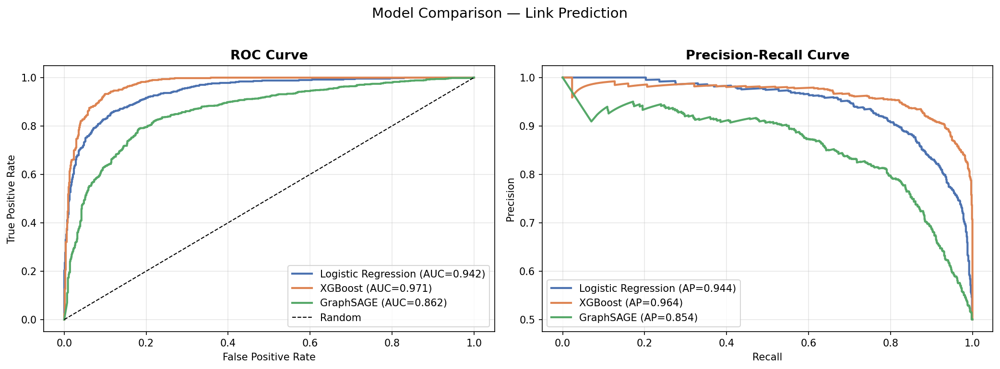
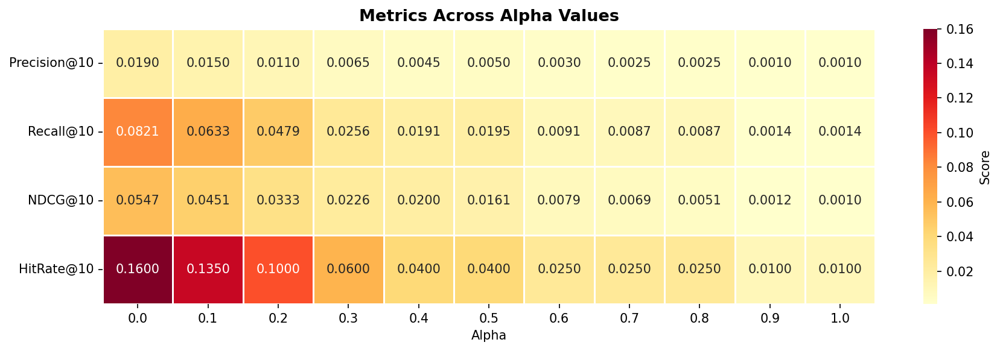

# 🎮 Twitch User Recommendation — ML, Neo4j & PostgreSQL

> A full-stack recommendation system combining **graph databases (Neo4j + PostgreSQL)**, **ML-based link prediction (Logistic Regression 0.94, XGBoost AUC-ROC 0.97, GraphSAGE 0.86)**, **real-time Kafka event streaming**, and **Airflow batch orchestration** - built on the Twitch social network graph to surface personalized user recommendations at scale.

---

## 🏗️ Architecture

```
┌─────────────────────────────────────┐
│   Twitch Activity Simulator         │
│   (Kafka Producer)                  │
│   follow / watch / game_play events │
└────────────────┬────────────────────┘
                 │
                 ▼
        Kafka Topic: twitch-events
                 │
                 ▼
┌────────────────────────────────────┐
│         Kafka Consumer             │
│  • Updates interaction scores      │
│    in PostgreSQL                   │
│  • Refreshes edge weights          │
│    in Neo4j                        │
└────────────────────────────────────┘

         +

┌────────────────────────────────────┐
│     Airflow DAG (runs daily)       │
│                                    │
│  ingest_data                       │
│       ↓                            │
│  compute_similarity                │
│  (Jaccard + Cosine)                │
│       ↓                            │
│  refresh_neo4j                     │
│       ↓                            │
│  validate_recommendations          │
│       ↓                            │
│  log_run_summary                   │
└────────────────────────────────────┘

    PostgreSQL ←──────────────→ Neo4j
  (user data,               (social graph,
   scores,                   similarity
   run logs)                 edges)
```

---

## 🎯 Problem

Recommending relevant users on a social platform like Twitch requires understanding both shared interests and network relationships. This project combines a **relational database (PostgreSQL)** for structured user data with a **graph database (Neo4j)** to model social connections.

The system operates at two layers:
- **Real-time**: Kafka streams user activity events and incrementally updates scores as users interact
- **Batch**: Airflow runs a daily pipeline to recompute similarity scores from scratch, refresh the graph, and validate recommendation quality

---

## 📊 Results

### Link Prediction (ML Models)

Reframing recommendation as a supervised **link prediction** problem — predicting the probability a connection will form between any two users — yields significantly stronger results than similarity-based approaches.

**18 features engineered per user pair**: common neighbors, Jaccard similarity, Adamic-Adar score, cosine similarity, SVD dot product, PageRank, in/out degree, clustering coefficient, and community membership.

| Model | AUC-ROC | Avg Precision | F1 |
|-------|---------|--------------|-----|
| Logistic Regression | 0.9425 | 0.9442 | 0.8640 |
| **XGBoost** | **0.9711** | **0.9631** | **0.9131** |
| GraphSAGE (improved) | 0.8562 | 0.8582 | 0.7519 |

Evaluated on 2,000 held-out user pairs (50% positive edges, 50% random non-edges).



### 🔑 Key Findings

**XGBoost (AUC-ROC 0.9711)** correctly ranks a real connection above a random non-connection 97% of the time — strong performance for link prediction on a real-world social graph.

**Logistic Regression (AUC-ROC 0.9425)** performs surprisingly well as a linear baseline, indicating that the engineered graph topology features are highly discriminative on their own — particularly common neighbors, Jaccard similarity, and Adamic-Adar score.

**GraphSAGE (AUC-ROC 0.8562)** improved significantly from an initial 0.7630 by replacing 2,549-dim sparse binary game features with 32-dim dense SVD embeddings as node features, adding a third convolutional layer, increasing hidden dimensions to 128, and applying a learning rate scheduler with early stopping. This confirms that richer node representations are the primary bottleneck for GNN performance on this dataset.

### Similarity-Based Baseline (SVD + Content)

| Metric | Score |
|--------|-------|
| Hit Rate@10 | 0.1600 |
| Recall@10 | 0.0821 |
| NDCG@10 | 0.0547 |
| Best model | Pure SVD (alpha=0.0) |

Alpha sweep across 11 values revealed pure SVD on graph structure outperforms all content-feature blends — Hit Rate@10 drops 16x from alpha=0.0 to alpha=1.0, confirming graph topology is more predictive than user feature similarity on this dataset.



---

## 🔍 Approach

### Similarity Metrics
- **Jaccard Similarity** — measures overlap in shared game/category preferences between users
- **Cosine Similarity** — measures directional alignment of user feature vectors

### Real-Time Layer (Kafka)
- Producer simulates Twitch user activity at 10 events/second
- Consumer reads events, applies weighted scoring (follow=3.0, watch=2.0, game_play=1.5), and updates PostgreSQL + Neo4j incrementally

### Batch Layer (Airflow)
- Daily DAG recomputes full similarity matrix across all users
- Pushes top similarity edges (score > 0.1) back into Neo4j
- Validates top-5 recommendations for a sample of users
- Logs run metrics to PostgreSQL for monitoring

---

## 🛠️ Tech Stack

| Category | Tools |
|----------|-------|
| Streaming | Apache Kafka, Zookeeper |
| Orchestration | Apache Airflow |
| Graph Database | Neo4j, Cypher, Graph Data Science Library |
| Relational Database | PostgreSQL |
| Data Processing | Python, Pandas |
| Containerization | Docker, Docker Compose |
| Similarity Metrics | Jaccard Similarity, Cosine Similarity |

---

## 📁 Repository Structure

```
├── kafka/
│   ├── producer.py              # Simulates Twitch user activity events
│   ├── consumer.py              # Processes events, updates scores + graph
│   ├── Dockerfile.producer
│   ├── Dockerfile.consumer
│   └── requirements.txt
├── airflow/
│   ├── dags/
│   │   └── recommendation_pipeline.py   # Daily batch DAG
│   └── requirements.txt
├── scoring.py                   # Original standalone similarity scoring
├── load_json_data.py            # Original data loader
├── postgresql_table_creation.sql
├── neo4j.cypher
├── musae_ENGB_edges.csv         # Twitch social graph edges
├── musae_ENGB_features.json     # User feature vectors
├── musae_ENGB_target.csv        # User labels
├── docker-compose.yml           # Spins up all services
├── .env.example                 # Environment variable template
├── 202 - Final Report.pdf
└── README.md
```

---

## 🚀 How to Run

### Prerequisites
- Docker Desktop installed and running
- At least 8GB RAM allocated to Docker (Kafka + Neo4j + Airflow are memory-intensive)

### Steps

1. Clone the repository
```bash
git clone https://github.com/keertanakappuram/Twitch-User-Recommendations-Using-Neo4j-and-PostgreSQL_202_Project.git
cd Twitch-User-Recommendations-Using-Neo4j-and-PostgreSQL_202_Project
```

2. Set up environment variables
```bash
cp .env.example .env
# Edit .env with your preferred passwords
```

3. Start all services
```bash
docker-compose up --build
```

4. Access the services

| Service | URL |
|---------|-----|
| Airflow UI | http://localhost:8080 (admin/admin) |
| Neo4j Browser | http://localhost:7474 |
| PostgreSQL | localhost:5432 |
| Kafka | localhost:9092 |

5. Trigger the Airflow DAG manually on first run via the Airflow UI, or wait for the daily schedule

### Standalone mode (without Docker)
To run the original scoring pipeline without Kafka/Airflow, follow the setup instructions in the original README section below.

---

## 📦 Dataset

This project uses the [Twitch Social Network Dataset (MUSAE)](https://snap.stanford.edu/data/twitch-social-networks.html) from Stanford SNAP — a real-world graph dataset of Twitch user connections and features across different language communities.
